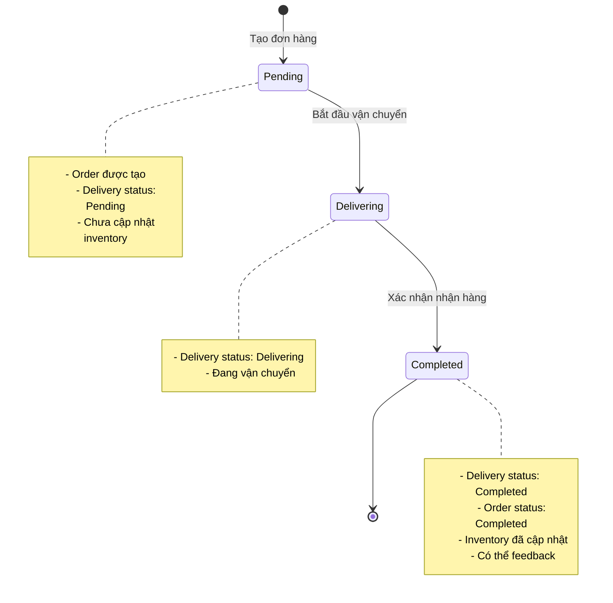

# Franchise Store Staff - Internal Order Flow

## Tổng quan
**Actor**: Franchise Store Staff (Nhân viên cửa hàng franchise)

**Mục đích**: Đặt hàng nội bộ từ kho trung tâm để bổ sung hàng hóa cho cửa hàng

---

## Flow chi tiết

### 1️⃣ Tạo đơn hàng (Create Internal Order)

**Trang**: [Create.cshtml](file:///d:/FranLink_PRN222/FranLink_BE/PresentationLayer_FranLink/Pages/InternalOrders/Create.cshtml)

**Các bước**:

1. **Nhân viên truy cập trang tạo đơn**
   - URL: `/InternalOrders/Create`
   - Hệ thống load danh sách sản phẩm từ database

2. **Chọn thông tin đơn hàng**
   - Chọn cửa hàng (FranchiseStore) - *hiện tại hardcode, sau này sẽ tự động lấy từ user claims*
   - Thêm sản phẩm vào đơn:
     - Chọn sản phẩm từ dropdown
     - Nhập số lượng
     - Có thể thêm nhiều sản phẩm (nút "Add Item")
     - Có thể xóa sản phẩm (nút "Remove")

3. **Submit đơn hàng**
   - Click "Create Order"
   - Backend xử lý:
     ```csharp
     // InternalOrderService.CreateOrderAsync()
     
     // Bước 1: Validate cửa hàng tồn tại
     var store = await _context.FranchiseStores.FindAsync(dto.FranchiseStoreId);
     
     // Bước 2: Kiểm tra tồn kho
     // - Tính tổng số lượng sản phẩm trong hệ thống
     // - So sánh với số lượng yêu cầu
     var totalQuantity = await _context.Inventories
         .Where(i => i.ProductId == itemDto.ProductId)
         .SumAsync(i => i.Quantity);
     
     // Bước 3: Tạo InternalOrder
     var order = new InternalOrder {
         FranchiseStoreId = dto.FranchiseStoreId,
         UserId = dto.UserId,
         OrderDate = DateTime.UtcNow,
         Status = "Pending"
     };
     
     // Bước 4: Tạo Delivery record
     var delivery = new Delivery {
         DeliveryId = Guid.NewGuid(),
         DeliveryStatus = "Pending",
         DeliveredAt = null
     };
     order.Delivery = delivery;
     
     // Bước 5: Tạo InternalOrderItems
     // Bước 6: Lưu vào database
     ```

4. **Kết quả**
   - ✅ Thành công: Chuyển về trang Index
   - ❌ Thất bại: Hiển thị lỗi (ví dụ: không đủ hàng)

---

### 2️⃣ Xem danh sách đơn hàng (View Orders)

**Trang**: [Index.cshtml](file:///d:/FranLink_PRN222/FranLink_BE/PresentationLayer_FranLink/Pages/InternalOrders/Index.cshtml.cs)

**Các bước**:

1. **Truy cập trang danh sách**
   - URL: `/InternalOrders/Index`
   - Hệ thống lấy `storeId` (hiện tại hardcode = 1)

2. **Hiển thị danh sách đơn hàng**
   - Chỉ hiển thị đơn của cửa hàng mình
   - Thông tin hiển thị:
     - Order ID
     - Ngày đặt hàng
     - Trạng thái (Pending/Delivering/Completed)
     - Tổng số items

3. **Logic trạng thái**
   ```csharp
   private string GetStatus(InternalOrder order)
   {
       if (order.Status == "Completed") return "Completed";
       if (order.Delivery?.DeliveryStatus == "Delivering") return "Delivering";
       return order.Status; // Pending
   }
   ```

---

### 3️⃣ Xem chi tiết đơn hàng (View Order Details)

**Trang**: [Details.cshtml](file:///d:/FranLink_PRN222/FranLink_BE/PresentationLayer_FranLink/Pages/InternalOrders/Details.cshtml)

**Các bước**:

1. **Truy cập chi tiết đơn**
   - URL: `/InternalOrders/Details/{id}`
   - Load thông tin đơn hàng với:
     - Delivery info
     - Order items
     - Product details

2. **Thông tin hiển thị**
   - **Order Information**:
     - Order Date
     - Status
     - Delivery Status
     - Delivered At
   
   - **Items Table**:
     - Product name
     - Quantity
     - Unit Price
     - Total

3. **Các action có thể thực hiện**
   - Xem nút "Confirm Received" (nếu đủ điều kiện)
   - Xem nút "Give Feedback" (nếu đã hoàn thành)

---

### 4️⃣ Xác nhận nhận hàng (Confirm Received)

**Điều kiện hiển thị nút**:
```csharp
CanConfirmReceived = Order.Delivery != null &&
                     Order.Delivery.DeliveryStatus == "Completed" &&
                     Order.Status != "Completed";
```

**Các bước**:

1. **Nhân viên click "Confirm Received"**
   - Form submit với handler `OnPostConfirmReceivedAsync`

2. **Backend xử lý**
   ```csharp
   // InternalOrderService.ConfirmOrderReceivedAsync()
   
   // Bước 1: Validate đơn hàng
   var order = await _context.InternalOrders
       .Include(o => o.Delivery)
       .Include(o => o.Items)
       .FirstOrDefaultAsync(o => o.Id == orderId);
   
   // Bước 2: Kiểm tra điều kiện
   if (order.Delivery?.DeliveryStatus != "Completed")
       throw new Exception("Delivery is not completed.");
   
   // Bước 3: Cập nhật trạng thái đơn hàng
   order.Status = "Completed";
   
   // Bước 4: Cập nhật inventory
   foreach (var item in order.Items)
   {
       var inventory = await _context.Inventories
           .FirstOrDefaultAsync(i => 
               i.FranchiseStoreId == order.FranchiseStoreId && 
               i.ProductId == item.ProductId);
       
       if (inventory == null)
       {
           // Tạo mới inventory record
           inventory = new Inventory {
               FranchiseStoreId = order.FranchiseStoreId,
               ProductId = item.ProductId,
               Quantity = 0
           };
           _context.Inventories.Add(inventory);
       }
       
       // Cộng số lượng vào kho
       inventory.Quantity += item.Quantity;
   }
   
   // Bước 5: Lưu thay đổi
   await _context.SaveChangesAsync();
   ```

3. **Kết quả**
   - Đơn hàng chuyển sang trạng thái "Completed"
   - Inventory của cửa hàng được cập nhật
   - Hiển thị thông báo thành công

---

### 5️⃣ Đánh giá chất lượng (Give Feedback)

**Điều kiện hiển thị**:
```csharp
CanGiveFeedback = Order.Status == "Completed";
```

**Các bước**:

1. **Click "Give Feedback" cho sản phẩm**
   - Mở modal feedback

2. **Nhập thông tin feedback**
   - Rating: 1-5 sao
   - Comment: Nhận xét

3. **Submit feedback**
   - **Kiểm tra user đã login**: Lấy `UserId` từ Session
   - Nếu chưa login → Hiển thị lỗi "You must be logged in to submit feedback"
   - Backend lưu vào bảng `QualityFeedback`
   ```csharp
   // Lấy UserId từ Session
   var userIdString = HttpContext.Session.GetString("UserId");
   
   if (string.IsNullOrEmpty(userIdString) || !Guid.TryParse(userIdString, out Guid userId))
   {
       ModelState.AddModelError("", "You must be logged in to submit feedback. Please login first.");
       return Page();
   }
   
   var feedback = new QualityFeedback {
       QualityFeedbackId = Guid.NewGuid(),
       UserId = userId, // Lấy từ Session
       ProductId = Feedback.ProductId,
       Rating = Feedback.Rating,
       Comment = Feedback.Comment,
       CreatedAt = DateTime.UtcNow
   };
   await _orderService.AddFeedbackAsync(feedback);
   ```

4. **Kết quả**
   - ✅ Thành công: Hiển thị "Feedback submitted successfully"
   - ❌ Chưa login: Hiển thị lỗi yêu cầu login

---

## Sơ đồ trạng thái đơn hàng



---

## Các điểm cần lưu ý

### 🔐 Authentication & Authorization
**Hiện tại**: Sử dụng Session để lưu `UserId`
- `storeId` hardcode = 1 (trong Index page)
- `userId` lấy từ Session khi submit feedback
- Nếu chưa có trong Session → Yêu cầu login

**Cách hoạt động**:
```csharp
// Khi user login (cần implement trang Login)
HttpContext.Session.SetString("UserId", user.UserId.ToString());

// Khi cần lấy user
var userIdString = HttpContext.Session.GetString("UserId");
```

**Cần làm tiếp**:
- Tạo trang Login để set Session
- Implement logout để clear Session
- Lưu thêm `StoreId` vào Session
- Implement role-based authorization

### 📦 Inventory Check
- Kiểm tra tổng tồn kho trong **toàn hệ thống**
- Không còn khái niệm "Central Kitchen" (đã comment out)
- Sử dụng `SumAsync` để tính tổng quantity

### 🚚 Delivery Lifecycle
1. **Pending**: Đơn hàng mới tạo
2. **Delivering**: Đang vận chuyển (do actor khác cập nhật)
3. **Completed**: Đã giao hàng, chờ xác nhận nhận

### 💾 Database Updates
- Inventory chỉ được cập nhật khi **Confirm Received**
- Không trừ inventory khi tạo đơn (chỉ validate)
