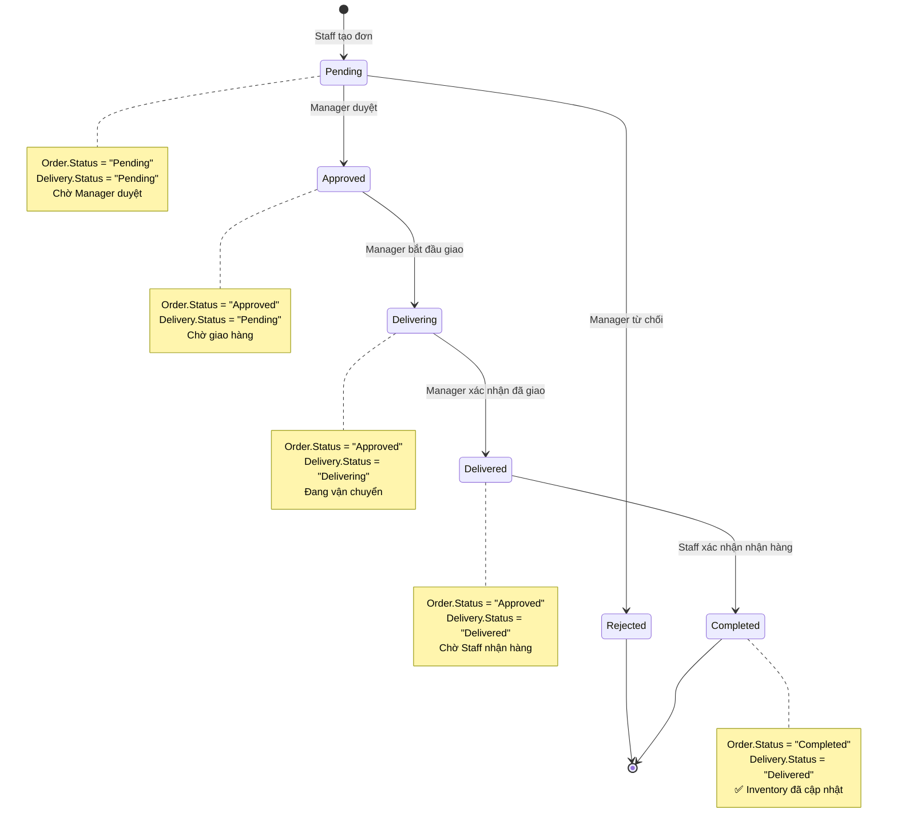
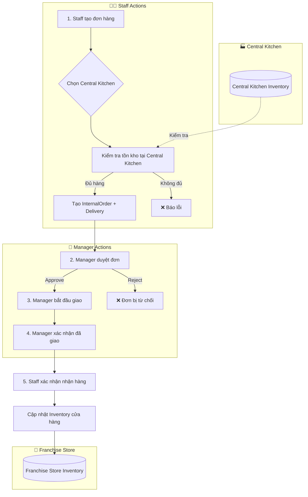

# Internal Order Flow - Complete Documentation

## 📋 Tổng quan

**Mục đích**: Quản lý luồng đặt hàng nội bộ từ Franchise Store đến Central Kitchen

### Actors (Vai trò tham gia)

| Actor | Vai trò | Chức năng |
|-------|---------|-----------|
| **Staff** | Nhân viên cửa hàng | Tạo đơn hàng, xác nhận nhận hàng, feedback |
| **Manager** | Quản lý | Duyệt đơn, cập nhật trạng thái giao hàng |

### Các trạng thái đơn hàng

```
┌─────────────────────────────────────────────────────────────────────────────┐
│                        INTERNAL ORDER WORKFLOW                               │
├─────────────────────────────────────────────────────────────────────────────┤
│                                                                              │
│  ┌──────────┐     ┌──────────┐     ┌────────────┐     ┌───────────┐         │
│  │ PENDING  │ ──► │ APPROVED │ ──► │ DELIVERING │ ──► │ DELIVERED │         │
│  └──────────┘     └──────────┘     └────────────┘     └───────────┘         │
│       │                                                      │               │
│   Staff tạo        Manager          Manager               Manager           │
│    đơn hàng         duyệt        bắt đầu giao        xác nhận đã giao       │
│                                                              │               │
│                                                              ▼               │
│                                                       ┌───────────┐         │
│                                                       │ COMPLETED │         │
│                                                       └───────────┘         │
│                                                              │               │
│                                                         Staff xác           │
│                                                        nhận nhận            │
│                                                                              │
└─────────────────────────────────────────────────────────────────────────────┘
```

### Bảng trạng thái chi tiết

| # | Order.Status | Delivery.Status | Ai thực hiện | Hành động | Cập nhật Inventory |
|---|--------------|-----------------|--------------|-----------|-------------------|
| 1 | **Pending** | Pending | Staff | Tạo đơn hàng | ❌ Không |
| 2 | **Approved** | Pending | Manager | Duyệt đơn | ❌ Không |
| 3 | **Approved** | Delivering | Manager | Bắt đầu giao | ❌ Không |
| 4 | **Approved** | Delivered | Manager | Hoàn thành giao | ❌ Không |
| 5 | **Completed** | Delivered | Staff | Xác nhận nhận hàng | ✅ **CỘNG kho Store** |

---

# 👨‍💼 PHẦN 1: STAFF FLOW (Nhân viên cửa hàng)

## 1️⃣ Tạo đơn hàng (Create Internal Order)

**Trang**: [Create.cshtml](file:///d:/FranLink_PRN222/FranLink_BE/PresentationLayer_FranLink/Pages/InternalOrders/Create.cshtml)

**Các bước**:

1. **Nhân viên truy cập trang tạo đơn**
   - URL: `/InternalOrders/Create`
   - Hệ thống load danh sách sản phẩm và Bếp Trung Tâm từ database

2. **Chọn thông tin đơn hàng**
   - Chọn cửa hàng (FranchiseStore) - *hiện tại hardcode, sau này sẽ tự động lấy từ user claims*
   - Chọn Bếp Trung Tâm (CentralKitchen) - nguồn cung cấp hàng
   - Thêm sản phẩm vào đơn:
     - Chọn sản phẩm từ dropdown
     - Nhập số lượng
     - Có thể thêm nhiều sản phẩm (nút "Add Item")
     - Có thể xóa sản phẩm (nút "Remove")

3. **Submit đơn hàng**
   - Click "Create Order"
   - Backend xử lý:
     ```csharp
     // InternalOrderService.CreateOrderAsync()
     
     // Bước 1: Validate cửa hàng tồn tại
     var store = await _context.FranchiseStores.FindAsync(dto.FranchiseStoreId);
     
     // Bước 2: Validate Bếp Trung Tâm tồn tại
     var centralKitchen = await _context.CentralKitchens.FindAsync(dto.CentralKitchenId);
     
     // Bước 3: Kiểm tra tồn kho TẠI BẾP TRUNG TÂM
     // - Tính tổng số lượng sản phẩm trong kho của Bếp Trung Tâm được chọn
     // - So sánh với số lượng yêu cầu
     var totalQuantity = await _context.Inventories
         .Where(i => i.CentralKitchenId == dto.CentralKitchenId && i.ProductId == itemDto.ProductId)
         .SumAsync(i => i.Quantity);
     
     // Bước 4: Tạo InternalOrder
     var order = new InternalOrder {
         FranchiseStoreId = dto.FranchiseStoreId,
         CentralKitchenId = dto.CentralKitchenId,
         UserId = dto.UserId,
         OrderDate = DateTime.UtcNow,
         Status = "Pending"
     };
     
     // Bước 5: Tạo Delivery record
     var delivery = new Delivery {
         DeliveryId = Guid.NewGuid(),
         DeliveryStatus = "Pending",
         DeliveredAt = null
     };
     order.Delivery = delivery;
     
     // Bước 6: Tạo InternalOrderItems
     // Bước 7: Lưu vào database
     ```

4. **Kết quả**
   - ✅ Thành công: Chuyển về trang Index
   - ❌ Thất bại: Hiển thị lỗi (ví dụ: không đủ hàng trong kho Bếp Trung Tâm)

---

### 2️⃣ Xem danh sách đơn hàng (View Orders)

**Trang**: [Index.cshtml](file:///d:/FranLink_PRN222/FranLink_BE/PresentationLayer_FranLink/Pages/InternalOrders/Index.cshtml.cs)

**Các bước**:

1. **Truy cập trang danh sách**
   - URL: `/InternalOrders/Index`
   - Hệ thống lấy `storeId` (hiện tại hardcode = 1)

2. **Hiển thị danh sách đơn hàng**
   - Chỉ hiển thị đơn của cửa hàng mình
   - Thông tin hiển thị:
     - Order ID
     - Ngày đặt hàng
     - Trạng thái (Pending/Delivering/Completed)
     - Tổng số items

3. **Logic trạng thái**
   ```csharp
   private string GetStatus(InternalOrder order)
   {
       if (order.Status == "Completed") return "Completed";
       if (order.Delivery?.DeliveryStatus == "Delivering") return "Delivering";
       return order.Status; // Pending
   }
   ```

---

### 3️⃣ Xem chi tiết đơn hàng (View Order Details)

**Trang**: [Details.cshtml](file:///d:/FranLink_PRN222/FranLink_BE/PresentationLayer_FranLink/Pages/InternalOrders/Details.cshtml)

**Các bước**:

1. **Truy cập chi tiết đơn**
   - URL: `/InternalOrders/Details/{id}`
   - Load thông tin đơn hàng với:
     - Delivery info
     - Order items
     - Product details

2. **Thông tin hiển thị**
   - **Order Information**:
     - Order Date
     - Status
     - Delivery Status
     - Delivered At
   
   - **Items Table**:
     - Product name
     - Quantity
     - Unit Price
     - Total

3. **Các action có thể thực hiện**
   - Xem nút "Confirm Received" (nếu đủ điều kiện)
   - Xem nút "Give Feedback" (nếu đã hoàn thành)

---

### 4️⃣ Xác nhận nhận hàng (Confirm Received)

**Điều kiện hiển thị nút**:
```csharp
CanConfirmReceived = Order.Delivery != null &&
                     Order.Delivery.DeliveryStatus == "Completed" &&
                     Order.Status != "Completed";
```

**Các bước**:

1. **Nhân viên click "Confirm Received"**
   - Form submit với handler `OnPostConfirmReceivedAsync`

2. **Backend xử lý**
   ```csharp
   // InternalOrderService.ConfirmOrderReceivedAsync()
   
   // Bước 1: Validate đơn hàng
   var order = await _context.InternalOrders
       .Include(o => o.Delivery)
       .Include(o => o.Items)
       .FirstOrDefaultAsync(o => o.Id == orderId);
   
   // Bước 2: Kiểm tra điều kiện
   if (order.Delivery?.DeliveryStatus != "Completed")
       throw new Exception("Delivery is not completed.");
   
   // Bước 3: Cập nhật trạng thái đơn hàng
   order.Status = "Completed";
   
   // Bước 4: Cập nhật inventory
   foreach (var item in order.Items)
   {
       var inventory = await _context.Inventories
           .FirstOrDefaultAsync(i => 
               i.FranchiseStoreId == order.FranchiseStoreId && 
               i.ProductId == item.ProductId);
       
       if (inventory == null)
       {
           // Tạo mới inventory record
           inventory = new Inventory {
               FranchiseStoreId = order.FranchiseStoreId,
               ProductId = item.ProductId,
               Quantity = 0
           };
           _context.Inventories.Add(inventory);
       }
       
       // Cộng số lượng vào kho
       inventory.Quantity += item.Quantity;
   }
   
   // Bước 5: Lưu thay đổi
   await _context.SaveChangesAsync();
   ```

3. **Kết quả**
   - Đơn hàng chuyển sang trạng thái "Completed"
   - Inventory của cửa hàng được cập nhật
   - Hiển thị thông báo thành công

---

### 5️⃣ Đánh giá chất lượng (Give Feedback)

**Điều kiện hiển thị**:
```csharp
CanGiveFeedback = Order.Status == "Completed";
```

**Các bước**:

1. **Click "Give Feedback" cho sản phẩm**
   - Mở modal feedback

2. **Nhập thông tin feedback**
   - Rating: 1-5 sao
   - Comment: Nhận xét

3. **Submit feedback**
   - **Kiểm tra user đã login**: Lấy `UserId` từ Session
   - Nếu chưa login → Hiển thị lỗi "You must be logged in to submit feedback"
   - Backend lưu vào bảng `QualityFeedback`
   ```csharp
   // Lấy UserId từ Session
   var userIdString = HttpContext.Session.GetString("UserId");
   
   if (string.IsNullOrEmpty(userIdString) || !Guid.TryParse(userIdString, out Guid userId))
   {
       ModelState.AddModelError("", "You must be logged in to submit feedback. Please login first.");
       return Page();
   }
   
   var feedback = new QualityFeedback {
       QualityFeedbackId = Guid.NewGuid(),
       UserId = userId, // Lấy từ Session
       ProductId = Feedback.ProductId,
       Rating = Feedback.Rating,
       Comment = Feedback.Comment,
       CreatedAt = DateTime.UtcNow
   };
   await _orderService.AddFeedbackAsync(feedback);
   ```

4. **Kết quả**
   - ✅ Thành công: Hiển thị "Feedback submitted successfully"
   - ❌ Chưa login: Hiển thị lỗi yêu cầu login

---

# 👔 PHẦN 2: MANAGER FLOW (Quản lý)

## 6️⃣ Xem danh sách đơn hàng chờ duyệt (View Pending Orders)

**Trang**: `/Manager/Distribution` hoặc `/Manager/Operations`

**URL hiện tại**: Cần tạo trang quản lý đơn Internal Order cho Manager

**Các bước**:

1. **Manager đăng nhập** (role = "Manager" hoặc "Admin")
2. **Truy cập trang quản lý đơn hàng**
3. **Xem danh sách đơn hàng** với filter theo status:
   - Pending (chờ duyệt)
   - Approved (đã duyệt)
   - Delivering (đang giao)
   - Delivered (đã giao)
   - Completed (hoàn thành)

---

## 7️⃣ Duyệt đơn hàng (Approve Order)

**Điều kiện**: `Order.Status == "Pending"`

**Các bước**:

1. **Manager click "Approve"**
2. **Backend xử lý**:
   ```csharp
   // Cần implement: InternalOrderService.ApproveOrderAsync()
   
   public async Task<InternalOrder?> ApproveOrderAsync(int orderId)
   {
       var order = await _context.InternalOrders
           .Include(o => o.Delivery)
           .FirstOrDefaultAsync(o => o.Id == orderId);
       
       if (order == null || order.Status != "Pending") return null;
       
       order.Status = "Approved";
       await _context.SaveChangesAsync();
       return order;
   }
   ```

3. **Kết quả**:
   - `Order.Status` → "Approved"
   - `Delivery.Status` vẫn là "Pending"

---

## 8️⃣ Bắt đầu giao hàng (Start Delivery)

**Điều kiện**: `Order.Status == "Approved" && Delivery.Status == "Pending"`

**Các bước**:

1. **Manager click "Start Delivery"**
2. **Backend xử lý**:
   ```csharp
   // Cần implement: InternalOrderService.StartDeliveryAsync()
   
   public async Task<InternalOrder?> StartDeliveryAsync(int orderId)
   {
       var order = await _context.InternalOrders
           .Include(o => o.Delivery)
           .FirstOrDefaultAsync(o => o.Id == orderId);
       
       if (order == null || order.Status != "Approved") return null;
       if (order.Delivery == null || order.Delivery.DeliveryStatus != "Pending") return null;
       
       order.Delivery.DeliveryStatus = "Delivering";
       await _context.SaveChangesAsync();
       return order;
   }
   ```

3. **Kết quả**:
   - `Order.Status` vẫn là "Approved"
   - `Delivery.Status` → "Delivering"

---

## 9️⃣ Hoàn thành giao hàng (Complete Delivery)

**Điều kiện**: `Order.Status == "Approved" && Delivery.Status == "Delivering"`

**Các bước**:

1. **Manager click "Complete Delivery"** (khi shipper đã giao hàng đến cửa hàng)
2. **Backend xử lý**:
   ```csharp
   // Cần implement: InternalOrderService.CompleteDeliveryAsync()
   
   public async Task<InternalOrder?> CompleteDeliveryAsync(int orderId)
   {
       var order = await _context.InternalOrders
           .Include(o => o.Delivery)
           .FirstOrDefaultAsync(o => o.Id == orderId);
       
       if (order == null || order.Status != "Approved") return null;
       if (order.Delivery == null || order.Delivery.DeliveryStatus != "Delivering") return null;
       
       order.Delivery.DeliveryStatus = "Delivered"; // hoặc "Completed"
       order.Delivery.DeliveredAt = DateTime.UtcNow;
       await _context.SaveChangesAsync();
       return order;
   }
   ```

3. **Kết quả**:
   - `Order.Status` vẫn là "Approved"
   - `Delivery.Status` → "Delivered"
   - `Delivery.DeliveredAt` → Thời gian hiện tại
   - **Staff giờ có thể nhấn "Confirm Received"**

---

## 🔟 Từ chối đơn hàng (Reject Order) - Optional

**Điều kiện**: `Order.Status == "Pending"`

**Các bước**:

1. **Manager click "Reject"** với lý do
2. **Backend xử lý**:
   ```csharp
   // Cần implement: InternalOrderService.RejectOrderAsync()
   
   public async Task<InternalOrder?> RejectOrderAsync(int orderId, string? reason)
   {
       var order = await _context.InternalOrders.FindAsync(orderId);
       
       if (order == null || order.Status != "Pending") return null;
       
       order.Status = "Rejected";
       // Nếu có field Notes, lưu lý do
       await _context.SaveChangesAsync();
       return order;
   }
   ```

---

# 📊 SƠ ĐỒ TỔNG QUAN

## Sơ đồ trạng thái đơn hàng


```mermaid
stateDiagram-v2
    [*] --> Pending: Staff tạo đơn
    
    Pending --> Approved: Manager duyệt
    Pending --> Rejected: Manager từ chối
    
    Approved --> Delivering: Manager bắt đầu giao
    Delivering --> Delivered: Manager xác nhận đã giao
    Delivered --> Completed: Staff xác nhận nhận hàng
    
    Rejected --> [*]
    Completed --> [*]
    
    note right of Pending
        Order.Status = "Pending"
        Delivery.Status = "Pending"
        Chờ Manager duyệt
    end note
    
    note right of Approved
        Order.Status = "Approved"
        Delivery.Status = "Pending"
        Chờ giao hàng
    end note
    
    note right of Delivering
        Order.Status = "Approved"
        Delivery.Status = "Delivering"
        Đang vận chuyển
    end note
    
    note right of Delivered
        Order.Status = "Approved"
        Delivery.Status = "Delivered"
        Chờ Staff nhận hàng
    end note
    
    note right of Completed
        Order.Status = "Completed"
        Delivery.Status = "Delivered"
        ✅ Inventory đã cập nhật
    end note
```

---

## Sơ đồ luồng dữ liệu


```mermaid
flowchart TD
    subgraph CK["🏭 Central Kitchen"]
        CK_INV[(Central Kitchen Inventory)]
    end
    
    subgraph FS["🏪 Franchise Store"]
        FS_INV[(Franchise Store Inventory)]
    end
    
    subgraph Staff["👨‍💼 Staff Actions"]
        A[1. Staff tạo đơn hàng] --> B{Chọn Central Kitchen}
        B --> C[Kiểm tra tồn kho tại Central Kitchen]
        C --> |Đủ hàng| D[Tạo InternalOrder + Delivery]
        C --> |Không đủ| E[❌ Báo lỗi]
    end
    
    subgraph Manager["👔 Manager Actions"]
        D --> F[2. Manager duyệt đơn]
        F --> |Approve| G[3. Manager bắt đầu giao]
        F --> |Reject| R[❌ Đơn bị từ chối]
        G --> H[4. Manager xác nhận đã giao]
    end
    
    H --> I[5. Staff xác nhận nhận hàng]
    I --> J[Cập nhật Inventory cửa hàng]
    
    CK_INV -.-> |Kiểm tra| C
    J --> FS_INV
```

---

# ✅ TRẠNG THÁI IMPLEMENTATION

## Đã implement (✅)

| Chức năng | File | Status |
|-----------|------|--------|
| Staff tạo đơn hàng | `Pages/InternalOrders/Create.cshtml` | ✅ Done |
| Staff xem danh sách đơn | `Pages/InternalOrders/Index.cshtml` | ✅ Done |
| Staff xem chi tiết đơn | `Pages/InternalOrders/Details.cshtml` | ✅ Done |
| Staff xác nhận nhận hàng | `InternalOrderService.ConfirmOrderReceivedAsync()` | ✅ Done |
| Staff gửi feedback | `InternalOrderService.AddFeedbackAsync()` | ✅ Done |
| Kiểm tra tồn kho CK | `InternalOrderService.CreateOrderAsync()` | ✅ Done |
| Cập nhật inventory khi complete | `InternalOrderService.ConfirmOrderReceivedAsync()` | ✅ Done |

## Chưa implement (❌) - Cần làm

| Chức năng | Service Method | Page |
|-----------|----------------|------|
| Manager duyệt đơn | `ApproveOrderAsync()` | `Pages/Manager/Orders/Index.cshtml` |
| Manager từ chối đơn | `RejectOrderAsync()` | `Pages/Manager/Orders/Index.cshtml` |
| Manager bắt đầu giao | `StartDeliveryAsync()` | `Pages/Manager/Orders/Details.cshtml` |
| Manager hoàn thành giao | `CompleteDeliveryAsync()` | `Pages/Manager/Orders/Details.cshtml` |

---

# 🧪 HƯỚNG DẪN TEST

## Test Case 1: Tạo đơn hàng thành công

**Preconditions:**
- Có sản phẩm trong database
- Có Central Kitchen với inventory đủ
- User đã đăng nhập

**Steps:**
1. Login với account Staff
2. Truy cập `/InternalOrders/Create`
3. Chọn Franchise Store
4. Chọn Central Kitchen
5. Thêm sản phẩm + số lượng
6. Click "Create Order"

**Expected Result:**
- ✅ Đơn hàng được tạo với `Status = "Pending"`
- ✅ Delivery được tạo với `DeliveryStatus = "Pending"`
- ✅ Redirect về trang Index

---

## Test Case 2: Tạo đơn hàng - Không đủ hàng

**Preconditions:**
- Central Kitchen không có đủ số lượng sản phẩm yêu cầu

**Steps:**
1. Tạo đơn hàng với số lượng > tồn kho

**Expected Result:**
- ❌ Hiển thị lỗi "Insufficient inventory for product..."

---

## Test Case 3: Duyệt đơn hàng (Manager)

**⚠️ LƯU Ý: Chức năng này CHƯA IMPLEMENT - cần làm**

**Workaround để test tiếp:**
Cập nhật trực tiếp trong database:
```sql
UPDATE "InternalOrders" SET "Status" = 'Approved' WHERE "Id" = <order_id>;
```

---

## Test Case 4: Bắt đầu giao hàng (Manager)

**⚠️ LƯU Ý: Chức năng này CHƯA IMPLEMENT - cần làm**

**Workaround để test tiếp:**
```sql
UPDATE "Deliveries" SET "DeliveryStatus" = 'Delivering' WHERE "InternalOrderId" = <order_id>;
```

---

## Test Case 5: Hoàn thành giao hàng (Manager)

**⚠️ LƯU Ý: Chức năng này CHƯA IMPLEMENT - cần làm**

**Workaround để test tiếp:**
```sql
UPDATE "Deliveries" 
SET "DeliveryStatus" = 'Delivered', "DeliveredAt" = NOW() 
WHERE "InternalOrderId" = <order_id>;
```

---

## Test Case 6: Staff xác nhận nhận hàng

**Preconditions:**
- Đơn hàng có `Order.Status = "Approved"`
- Delivery có `DeliveryStatus = "Delivered"` (hoặc "Completed")

**Steps:**
1. Login với account Staff
2. Truy cập `/InternalOrders/Details/{orderId}`
3. Click "Confirm Received"

**Expected Result:**
- ✅ `Order.Status` → "Completed"
- ✅ Inventory của Franchise Store được cộng thêm số lượng sản phẩm
- ✅ Hiển thị thông báo thành công

---

## Test Case 7: Feedback sản phẩm

**Preconditions:**
- Đơn hàng có `Order.Status = "Completed"`
- User đã đăng nhập

**Steps:**
1. Truy cập chi tiết đơn hàng đã completed
2. Click "Give Feedback" cho một sản phẩm
3. Nhập Rating (1-5) + Comment
4. Submit

**Expected Result:**
- ✅ Feedback được lưu vào `QualityFeedback` table
- ✅ Hiển thị "Feedback submitted successfully"

---

## Các điểm cần lưu ý

### 🔐 Authentication & Authorization
**Hiện tại**: Sử dụng Session để lưu `UserId`, `Role`
- `storeId` hardcode = 1 (trong Index page)
- `userId` lấy từ Session khi submit feedback
- `Role` kiểm tra "Manager" hoặc "Admin" để truy cập trang quản lý

**Session keys đang dùng**:
```csharp
HttpContext.Session.GetString("UserId");   // Guid của user
HttpContext.Session.GetString("Role");     // "Staff", "Manager", "Admin"
HttpContext.Session.GetString("Username"); // Tên hiển thị
```

### 🏭 Central Kitchen (Bếp Trung Tâm)
- Mỗi đơn hàng nội bộ phải chọn **Bếp Trung Tâm** làm nguồn cung cấp
- `CentralKitchenId` được lưu trong `InternalOrder` (nullable để tương thích với orders cũ)
- Khi tạo đơn hàng, hệ thống kiểm tra tồn kho **tại Bếp Trung Tâm được chọn**

### 📦 Inventory Updates - QUAN TRỌNG

| Thời điểm | Cập nhật kho CK | Cập nhật kho Store |
|-----------|-----------------|-------------------|
| Tạo đơn hàng | ❌ Không trừ | ❌ Không cộng |
| Duyệt đơn | ❌ Không trừ | ❌ Không cộng |
| Bắt đầu giao | ❌ Không trừ | ❌ Không cộng |
| Hoàn thành giao | ❌ Không trừ | ❌ Không cộng |
| **Xác nhận nhận hàng** | ❌ Không trừ | ✅ **CỘNG** |

⚠️ **Lưu ý**: Hiện tại chưa có logic **trừ kho Central Kitchen** khi giao hàng.

### 🚚 Delivery Lifecycle
| Status | Mô tả |
|--------|-------|
| `Pending` | Đơn hàng mới tạo, chưa giao |
| `Delivering` | Đang vận chuyển |
| `Delivered` | Đã giao đến Store (hoặc `Completed`) |

---

## Data Models

### InternalOrder
```csharp
public class InternalOrder
{
    public int Id { get; set; }
    public int FranchiseStoreId { get; set; }
    public int? CentralKitchenId { get; set; }  // Nullable để tương thích với orders cũ
    public Guid UserId { get; set; }
    public DateTime OrderDate { get; set; }
    public string Status { get; set; }  // Pending, Completed
    
    // Navigation properties
    public FranchiseStore FranchiseStore { get; set; }
    public CentralKitchen CentralKitchen { get; set; }
    public User User { get; set; }
    public ICollection<InternalOrderItem> Items { get; set; }
    public Delivery Delivery { get; set; }
}
```

### CreateInternalOrderDto
```csharp
public class CreateInternalOrderDto
{
    public int FranchiseStoreId { get; set; }
    public int CentralKitchenId { get; set; }
    public Guid UserId { get; set; }
    public List<CreateInternalOrderItemDto> Items { get; set; }
}
```

### Inventory
```csharp
public class Inventory
{
    public Guid InventoryId { get; set; }
    
    // Location - either CentralKitchen OR FranchiseStore (one must be set)
    public int? CentralKitchenId { get; set; }
    public int? FranchiseStoreId { get; set; }
    
    public int ProductId { get; set; }
    public int Quantity { get; set; }
    // ...
}
```

---

# 🔄 SO SÁNH: INTERNAL ORDER VS INVENTORY TRANSFER

| Tiêu chí | Internal Order | Inventory Transfer |
|----------|---------------|-------------------|
| **Mục đích** | Staff đặt hàng từ Central Kitchen | Chuyển kho giữa các location |
| **Ai tạo** | Staff | Manager |
| **Nguồn** | Chỉ từ Central Kitchen | Bất kỳ (CK hoặc Store) |
| **Đích** | Chỉ đến Franchise Store | Bất kỳ (CK hoặc Store) |
| **Có Delivery** | ✅ Có | ❌ Không |
| **Số bước** | 5 bước | 3 bước |
| **Cập nhật kho khi** | Staff Confirm Received | Manager Complete |

### Internal Order Flow:
```
Pending → Approved → Delivering → Delivered → Completed
         (Manager)   (Manager)    (Manager)    (Staff)
```

### Inventory Transfer Flow:
```
Pending → Approved → Completed
         (Manager)   (Manager)
```

---

# 📁 CẤU TRÚC FILE

```
PresentationLayer_FranLink/
├── Pages/
│   ├── InternalOrders/           # Staff pages
│   │   ├── Index.cshtml          # Danh sách đơn hàng
│   │   ├── Create.cshtml         # Tạo đơn hàng
│   │   └── Details.cshtml        # Chi tiết + Confirm + Feedback
│   │
│   └── Manager/
│       ├── Orders/               # ❌ CHƯA CÓ - Cần tạo
│       │   ├── Index.cshtml      # Quản lý đơn Internal Order
│       │   └── Details.cshtml    # Approve/Reject/Deliver
│       │
│       └── Distribution/         # Báo cáo phân phối
│           ├── Index.cshtml
│           ├── ByStore.cshtml
│           └── ByProduct.cshtml

BusinessLogicLayer_FranLink/
├── Services/
│   ├── IInternalOrderService.cs
│   └── InternalOrderService.cs   # Cần thêm Approve/Deliver methods

DataAccessLayer_FranLink/
├── Models/
│   ├── InternalOrder.cs
│   ├── InternalOrderItem.cs
│   └── Delivery.cs
```

---

# 🛠️ VIỆC CẦN LÀM TIẾP

## Priority 1: Manager Order Management
1. Tạo `Pages/Manager/Orders/Index.cshtml` - Quản lý đơn hàng
2. Thêm methods vào `IInternalOrderService`:
   - `ApproveOrderAsync(int orderId)`
   - `RejectOrderAsync(int orderId, string? reason)`
   - `StartDeliveryAsync(int orderId)`
   - `CompleteDeliveryAsync(int orderId)`

## Priority 2: Fix Inventory Logic
1. Trừ kho Central Kitchen khi Start Delivery hoặc Complete Delivery
2. Hoặc reserve inventory khi Approve

## Priority 3: Improvements
1. Lấy StoreId từ Session thay vì hardcode
2. Thêm filter Status trong trang Index
3. Pagination cho danh sách đơn hàng
